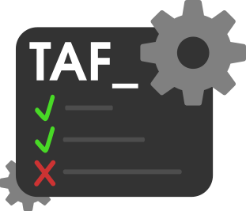

# TAF Refactored - TP2 MGL7760 (UQAM)

[](https://github.com/HamzaAfif/TAF-FALL-2025/actions)
[](https://sonarcloud.io/project/overview?id=HamzaAfif_TAF-FALL-2025)
[](https://sonarcloud.io/project/overview?id=HamzaAfif_TAF-FALL-2025)

Ce depot contient une version refactoree du TAF (Test Automation Framework) realisee dans le cadre du TP2 du cours MGL7760 a l'UQAM.

Le projet TAF original provient d'un projet etudiant de l'ETS. Cette version refactoree vise a le rendre plus simple a manipuler, plus stable a executer et plus facile a faire evoluer.

L'objectif est de maintenir une base de code plus stable, testable et observable, avec:
- un backend Spring Boot
- un frontend Angular
- des modules de performance (Gatling/JMeter)
- un service Python de generation de tests
- un pipeline CI/CD complet avec analyse SonarCloud et publication de documentation

## Contexte TP2 (MGL7760 - UQAM)

Cette version "TAF-Refactored" formalise le travail de refactorisation demande dans le TP2, a partir de la base etudiante issue de l'ETS:
- reduction de la dette technique
- stabilisation des tests et du pipeline
- standardisation des processus d'integration continue
- documentation du processus de correction et d'exploitation

Le guide de correction complet et a jour est disponible ici: [CI_CD_FIX_GUIDE.md](./CI_CD_FIX_GUIDE.md).

## Architecture du projet

- `backend/`: API principale Spring Boot (Java 17)
- `frontend/`: interface Angular
- `performance/`: tests de performance (Gatling/JMeter)
- `test-generation-service/`: service Python (generation de tests)
- `.github/workflows/ci-cd.yml`: pipeline CI/CD principal
- `sonar-project.properties`: configuration SonarCloud

## Prerequis

- Java 17
- Maven 3.9+
- Node.js 20+
- npm
- Python 3.11+

## Lancer le projet localement

## 1) Backend

Depuis la racine du projet:

```bash
mvn -N -f pom.docker.xml install -q
mvn -f performance/pom.xml clean install -DskipTests -q
mvn -f backend/pom.xml clean install
```

Pour executer les tests backend:

```bash
cd backend
mvn test jacoco:report -q
```

## 2) Frontend

```bash
cd frontend
npm install --legacy-peer-deps
npm start
```

Frontend accessible sur `http://localhost:4200`.

## 3) Service Python

```bash
cd test-generation-service
python -m pip install --upgrade pip
pip install -r requirements.txt
```

## 4) Execution locale orientee qualite (recommandee)

```bash
# Frontend tests + coverage
cd frontend
npm run test -- --watch=false --code-coverage

# Backend tests + coverage
cd ../backend
mvn test jacoco:report -q
```

## Pipeline CI/CD (resume)

Le workflow principal est: `.github/workflows/ci-cd.yml`.

Le pipeline execute notamment:
- build + tests backend
- build + tests frontend
- verifications performance
- tests du service Python
- analyse SonarCloud
- generation/publication de la documentation

Points importants du pipeline actuel:
- SonarCloud reste visible meme en cas de quality gate rouge (`sonar.qualitygate.wait=false`)
- la couverture backend est regeneree dans le job Sonar pour eviter les faux `0%`
- la documentation backend/frontend est publiee avec fallback pour garantir des URLs valides

## SonarCloud

Projet SonarCloud:
- Dashboard: <https://sonarcloud.io/project/overview?id=HamzaAfif_TAF-FALL-2025>
- Branche principale: <https://sonarcloud.io/dashboard?id=HamzaAfif_TAF-FALL-2025&branch=main>

Le fichier de configuration est: `sonar-project.properties`.

## Documentation generee

La documentation est generee dans le pipeline (frontend + backend) et publiee via GitHub Pages.

En local, pour verifier le backend:

```bash
cd backend
mvn test jacoco:report -q
```

Puis ouvrir le rapport de couverture:
- `backend/target/site/jacoco/index.html`

## Processus de correction CI/CD (historique + runbook)

Pour tout le detail des correctifs appliques, des incidents rencontres et de la procedure d'exploitation:

- [CI_CD_FIX_GUIDE.md](./CI_CD_FIX_GUIDE.md)

Ce document couvre:
- les correctifs frontend/backend/python
- les ajustements SonarCloud et couverture
- les correctifs JavaDoc
- la procedure de verification par etape

## Contribution

Pour une contribution propre:
1. creer une branche de travail
2. ajouter des tests avec votre changement
3. verifier localement (`mvn test`, `npm test`)
4. ouvrir une pull request avec description claire

## Statut

Projet actif dans le cadre du TP2 MGL7760.
Base refactoree, pipeline documente, et processus de stabilisation trace dans le guide CI/CD.