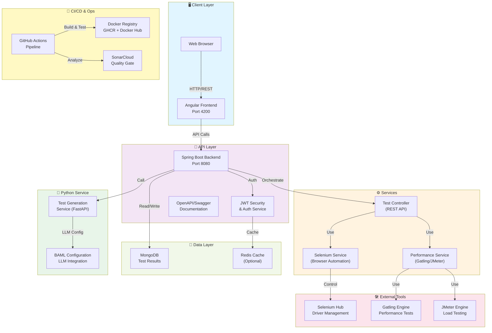
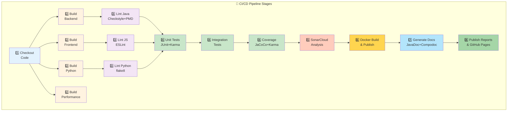
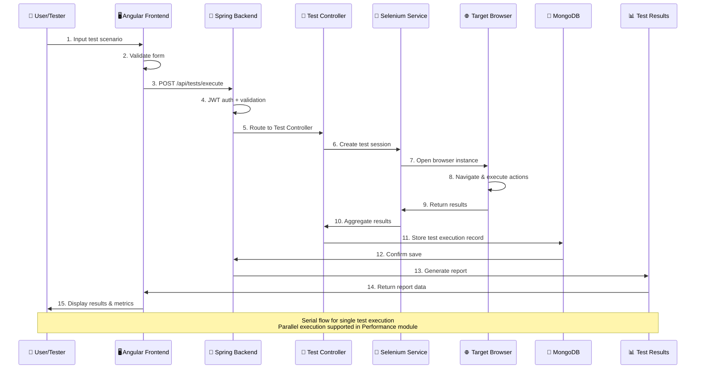
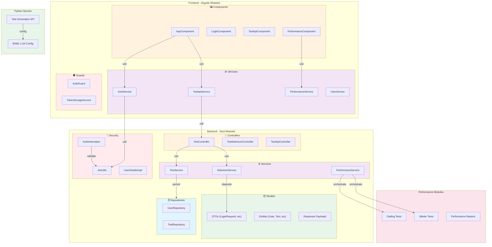
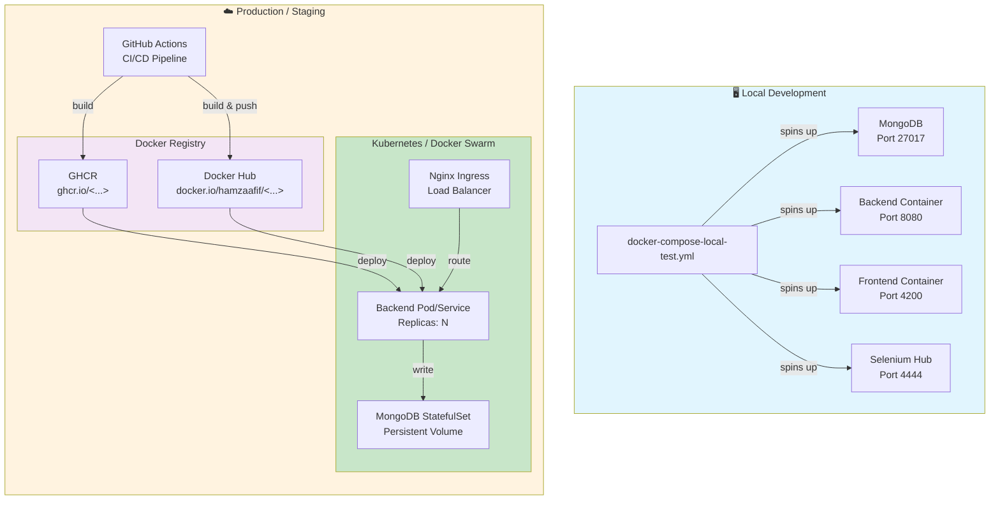
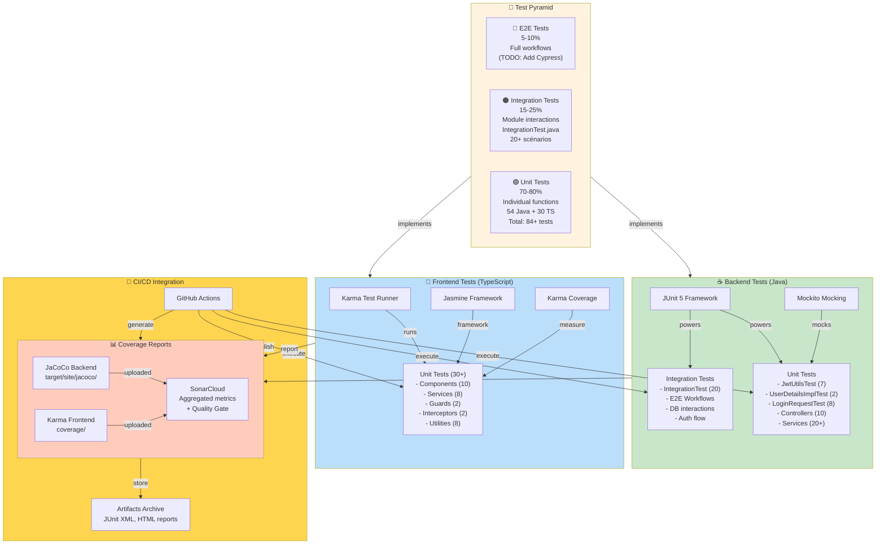

# 📊 Diagrammes Architecture - TAF-Refactored

Cette page contient les diagrammes automatiquement générés (Mermaid) qui documentent l'architecture, le flux et les dépendances du projet TAF.

## 1️⃣ Architecture Générale

**Vue d'ensemble:**
- **Frontend**: Angular SPA communicating via REST API
- **Backend**: Spring Boot microservice (principale Gateway)
- **Services**: Selenium pour automation, Gatling/JMeter pour performance
- **Data**: MongoDB for persistence
- **CI/CD**: GitHub Actions + SonarCloud + Docker publishing

---

## 2️⃣ Pipeline CI/CD

**Stages:**
1. Checkout code with full history
2. Build all modules in parallel
3. Lint & format validation
4. Run all test suites (unit + integration)
5. SonarCloud analysis + Quality Gate
6. Docker image build & push
7. Generate documentation
8. Publish reports & deploy to GitHub Pages

---

## 3️⃣ Flux d'Exécution d'un Test

---

## 4️⃣ Dépendances des Modules

---

## 5️⃣ Déploiement & Containers

---

## 6️⃣ Test Pyramid - Couverture

---

## 📝 Notes

- **Tous les diagrammes** sont générés automatiquement depuis des fichiers `.mmd` (Mermaid format)
- **Format Mermaid** est supporté nativement par GitHub et rend légende directement dans Markdown
- **Sources**: Voir dossier `docs/diagrams/`
- **Génération SVG**: Le pipeline CI/CD génère les versions PNG/SVG pour publication statique

## Mise à Jour des Diagrammes

Pour modifier un diagramme, édite le fichier `.mmd` correspondant:
- `architecture.mmd` - Vue d'ensemble système
- `ci-cd-pipeline.mmd` - Stages du pipeline
- `test-execution-flow.mmd` - Séquence d'exéc test
- `module-dependencies.mmd` - Modules et dépendances
- `deployment.mmd` - Infrastructure et déploiement
- `test-pyramid.mmd` - Stratégie test et couverture

Puis commit & push - les diagrammes se mettent à jour automatiquement dans GitHub Pages.
